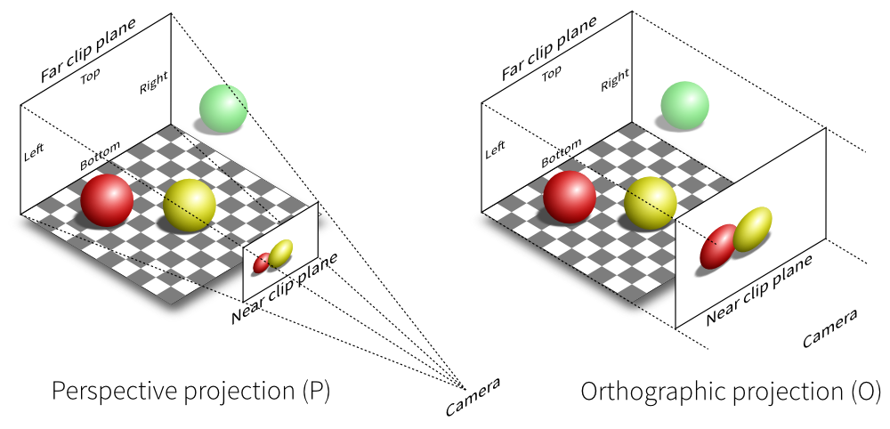
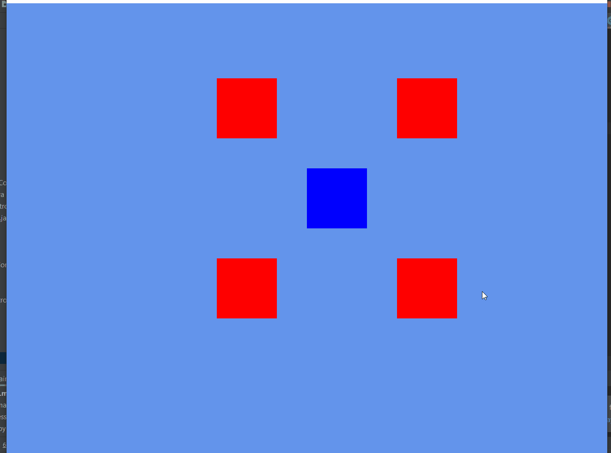

## 1.3. Utilisation de la camera
---

La camera contrôle la façon dont le joueur observe le monde de jeu. Une caméra représente un point dans l'espace avec lequel modifier les propriétés devient possible de manipuler ce qui est ultimement afficher a l'écran.

Il existe principalement deux sortes de caméras. La camera orthographique qui ne prends pas en compte la perspective de l'observateur est idéal pour le jeu en 2 dimensions.

### **Camera perspective vs orthographique**[^1]


---
> ### Étapes à suivre
> 1. Créez une instance de `OrthographicCamera` a l'intérieur de la classe `Game`
> 2. Configurez le `zoom` de la camera


```java
/* Game.java */
package com.tutorialquest;
// Utilisation de la camera offerte par LibGDX
import com.badlogic.gdx.graphics.OrthographicCamera;
// import ...

public class Game extends ApplicationAdapter {

    // AJOUT:
    public static OrthographicCamera camera;    

    @Override
    public void create() {
        // AJOUT:
        camera = new OrthographicCamera(
            VIEWPORT_WIDTH, 
            VIEWPORT_HEIGHT);
        // AJOUT:
        // Configuration du zoom de la camera
        camera.zoom = 0.25f;
        // ...
    }
}
```
La caméra, est définit à l'aide de deux matrices, la matrice *view* et *projection* [^2]. La matrice *view* spécifie la position et l'angle de la caméra. La matrice projection détermine la surface projetée par la caméra.

---
> ### Étapes à suivre
> 1. modifiez la méthode `render` de la classe `Avatar` afin de prendre en compte les deux matrices spécifiées ci-dessus.
> 2. mettre à jour la position de la caméra pour suivre le joueur.

```java
/* Avatar.java */
package com.tutorialquest.entities;
// import ...

public class Avatar extends Entity{

    // ...

    @Override
    public void render(SpriteBatch spriteBatch) {
        // AJOUT
        renderer.setProjectionMatrix(Game.camera.combined);
        renderer.begin(ShapeRenderer.ShapeType.Filled);
        renderer.setColor(Color.BLUE);
        renderer.rect(
            position.x,
            position.y,
            WIDTH,
            HEIGHT);
        renderer.end();
    }

    // ...
}
```
Puisque la caméra suit maintenant le joueur, le jeu n'est plus contenu exclusivement à l'intérieur de la fenêtre. Il n'y a pas de raison de spécifier la position des entités relativement au centre de la fenêtre.

---
> ### Étapes à suivre
> 1. changez l'emplacement initial des entités dans la classe `Level` 
> 2. mettre à jour la caméra dans la méthode `update` afin que la camera suive la position du joueur.

```java
/* Game.java */
package com.tutorialquest;
// import ...

public class Game extends ApplicationAdapter {
    // ..
    public static OrthographicCamera camera;    
    public static Level level;

    @Override
    public void create() {
        // ..
        level = new Level();
        // MODIF:
        level.add(level.avatar = new Avatar(Vector2.Zero.cpy()));
        level.add(new Enemy(Vector2.Zero.cpy().add(new Vector2(48f, 48f))));
        level.add(new Enemy(Vector2.Zero.cpy().add(new Vector2(48f, -48f))));
        level.add(new Enemy(Vector2.Zero.cpy().add(new Vector2(-48f, 48f))));
        level.add(new Enemy(Vector2.Zero.cpy().add(new Vector2(-48f, -48f))));
    }

    @Override
    public void render() {
        // ...        
        // AJOUT:
        // Mise à jour de la position de la camera
        // suivant la position du joueur        
        camera.position.set(Game.level.avatar.position, 0);
        camera.update();
    }
}

```

 


[^1]: https://glumpy.readthedocs.io/en/latest/_images/projection.png

[^2]: Une compréhension des matrices étudiées en mathématique n'est pas requise pour ce tutoriel. Ce qui est important de comprendre est que les matrices représentent une collection de variables nécessaires pour configurer la caméra. 

