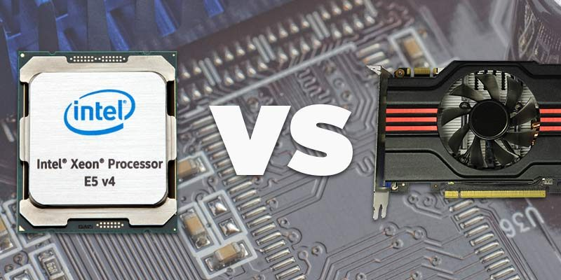
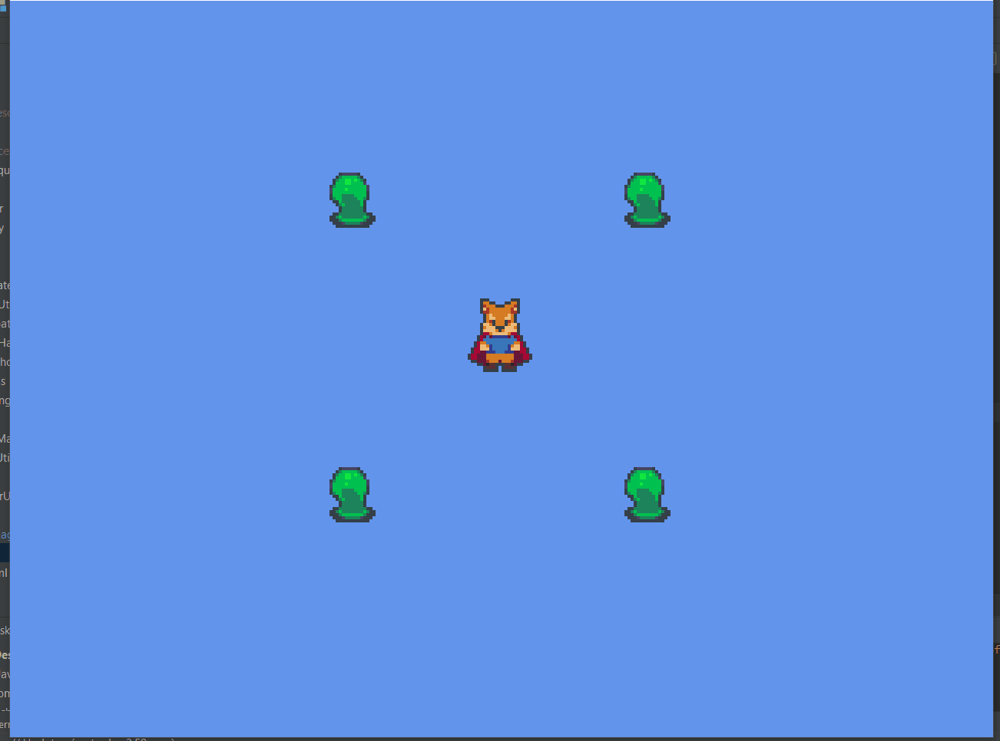
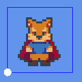
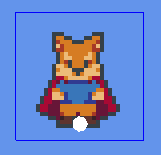

# 2. Sprites
| Téléchargement fichiers référence |
| ------------- |:-------------:|
| <a href="./resources/part-the-world/desktop.zip" download>desktop.zip</a> |
| <a href="./resources/part-the-world/core.src.zip" download>core.src.zip</a> |
| <a href="./resources/part-the-world/core.assets.zip" download>core.assets.zip</a> |

## 2.1. Sprites et SpriteBatch
---
Lorsqu'il s'agit des visuels pour les jeux vidéo en 2D, nos entités sont typiquement représentées à l'aide de `sprite`. Le sprite est le mécanisme haut niveau permettant d'encapsuler toutes les fonctionnalités propres a l'affichage d'une image a l'écran, telle la position, rotation, etc.

Étant donnée la séparation des composantes physique de notre ordinateur, soit le processeur et la [carte graphique](../glossary/glossary.md#Carte-Graphique), il est avantageux de réduire les interactions entre les deux composantes. À cet effet, LibGDX affiche du contenu à l'écran à l'aide de la classe `SpriteBatch`, qui combine plusieurs dessins dans une même "batch" qui sera envoyé à la carte graphique en un seul coup.

### **CPU vs. GPU**[^1]


---
> ### Étapes à suivre
> 1. créez une instance de `SpriteBatch` dans la classe `Game`
> 4. configurez l'instance `SpriteBatch` à l'aide des matrices de la camera
> 2. passez le `SpriteBatch` en paramètre de la méthode `render` pour le monde et les entités 
> 3. utilisez la classe `Sprite` qui encapsule l'affichage du sprite
> 4. modifiez l'avatar afin qu'il dessine un personnage à la place d'une boite


```plantuml
hide circle
skinparam classAttributeIconSize 0

class Sprite {    
    +flipX : boolean
    +flipY : boolean
    +size : Vector2
    +origin : Vector2
    +texture : TextureRegion
    +Sprite(String texturePath, int width, int height, int x, int y)
    +Sprite(String texturePath, Vector2 size)     
    +Sprite(String texturePath, int width, int height)
    +dispose() : void
    +update(float deltaTime) : void
    +render(SpriteBatch batch, Vector2 position) : void
}

```

```java
/* Game.java */
package com.tutorialquest.entities;
// import ..

public class Game extends ApplicationAdapter {
    // ..
    // AJOUT: référence au sprite batch
    private SpriteBatch spriteBatch;

    @Override
    public void create() {        
        // ..        
        // AJOUT
        spriteBatch = new SpriteBatch();
    }

    @Override
    public void render() {
        // ..        
        // AJOUT
        spriteBatch.setProjectionMatrix(camera.combined);
        level.render(spriteBatch);
    }

}
```


```java
/* Avatar.java */
package com.tutorialquest.entities;
// import ..

public class Avatar extends Entity{
    
    protected static int WIDTH = 32;
    protected static int HEIGHT = 32;

    // ..
    // AJOUT:
    private Sprite sprite = new Sprite("objects/avatar.png", WIDTH, HEIGHT);

    // ..

    @Override
    public void render(SpriteBatch spriteBatch) {
        sprite.render(spriteBatch, position);
    }
    
    // ..
}
```
 
---
Puisque l'origine de nos images se situe toujours dans le coin en bas à droite, la position du personnage ne correspond pas parfaitement à la position dans le monde.

### Sprite avec origine au coin à gauche par défaut
 


### Sprite avec origine aux pieds du personnage


---
> ### Étapes à suivre
> Modifiez la valeur de `sprite.origin` afin que la position d'origine soit aux pieds du personnage

```java
/* Avatar.java */
package com.tutorialquest.entities;
// import ..

public class Avatar extends Entity{    
    // ..
    public Avatar(Vector2 position)
    {
        super(position);
        sprite = new Sprite("objects/avatar.png", WIDTH, HEIGHT);
        // AJOUT:
        // Configuration de l'origine du sprite
        sprite.origin = new Vector2(WIDTH/2, HEIGHT/8);
    }
    // ..
}
```
> ## Activité
> ---
> 1. Ajoutez un sprite a `Enemy`
> 2. Changez l'affichage de l'ennemi afin qu'il affiche un personnage.


[^1]: https://www.maketecheasier.com/difference-between-cpu-and-gpu/