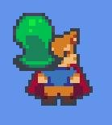
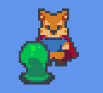
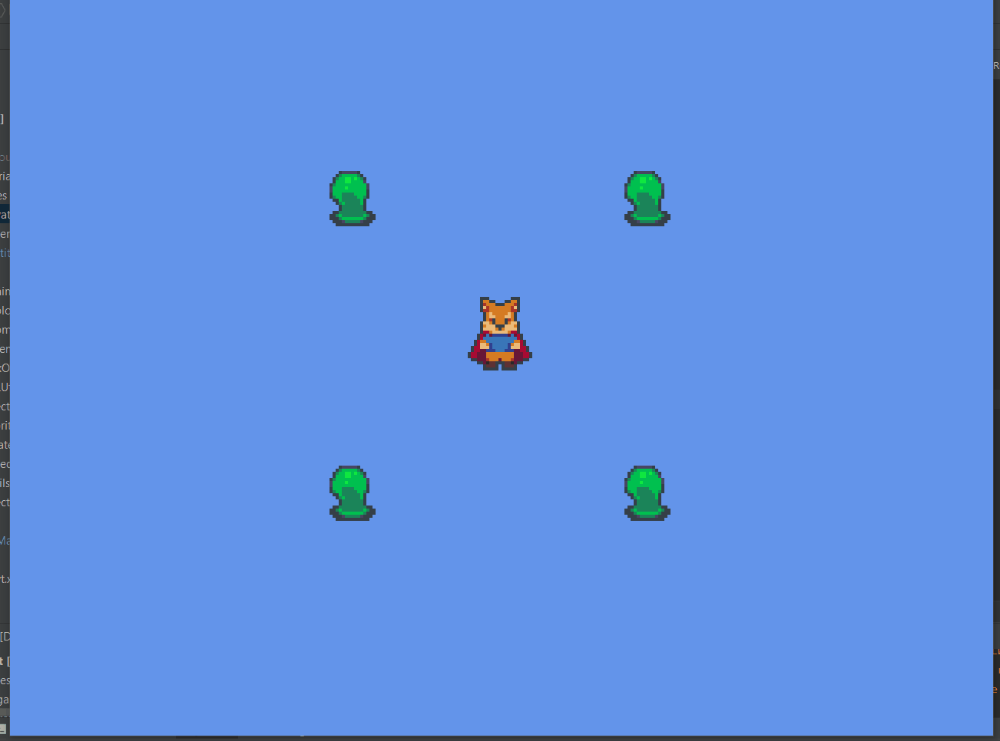

## 2.2. Sprites et effet profondeur
---

Comme vous surement peut le remarquer, la profondeur des *sprite* n'est pas affichée comme on le voudrait.



Plus précisément, nous voudrions que les entités situées plus en bas de l'écran soient affichées à l'avant tandis que les entités au-dessus affichées à l'arrière. Afin d'arriver à cet effet, il est important de comprendre comment la méthode `render` de la classe `SpriteBatch` de LibGDX fonctionne.

  

Lorsqu'un appel a `SpriteBatch.begin` est effectué, l'image n'est pas immédiatement dessinée a l'écran. A la place, la requête pour l'affichage est mise dans une **file d'attente** qui sera ensuite envoyée au [GPU](../glossary/glossary.md#Carte-Graphique). Le GPU traite ensuite les requêtes en ordre d'arrivée dans la file d'attente. Donc dans le but d'afficher les *sprite* plus en bas a l'avant, il sera nécessaire de réordonner les entités dans la liste en fonction de leur `position.y` à chaque fois qu'il y a un changement. 

---
> ### Étapes à suivre
> A l'intérieur de la méthode `update` de la classe `Level`, réordonne la liste des entités en fonction de la valeur `-position.y`.

```java
/* Level.java */
package com.tutorialquest;
// import ...

public class Level {
    // ...
    public void render(SpriteBatch batch) {
        // AJOUT:
        // triage des entites selon leur profondeurs
        entities.sort(Comparator.comparing(x -> -x.position.y));
        for (Entity ent : entities) {
            ent.render(batch);
        }
    }
}
```

 